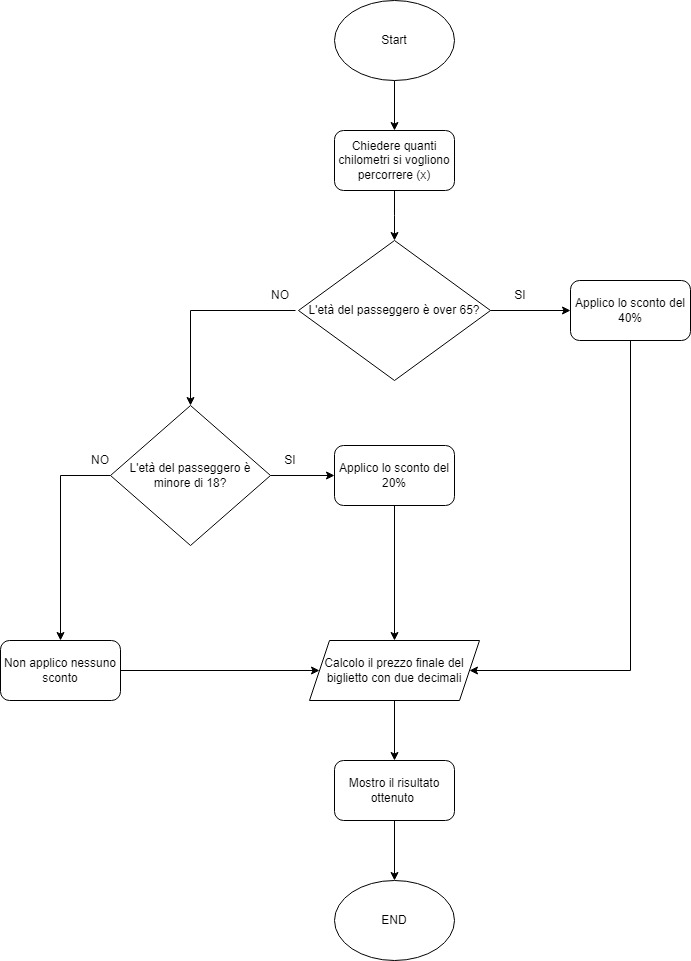

###Esercizio
Il programma dovrà chiedere all'utente il numero di chilometri che vuole percorrere e l'età del passeggero.
Sulla base di queste informazioni dovrà calcolare il prezzo totale del viaggio, secondo queste regole:
- Il prezzo del biglietto è definito in base ai km (0.21 € al km)
- Va applicato uno sconto del 20% per i minorenni
- Va applicato uno sconto del 40% per gli over 65.
- L'output del prezzo finale va messo fuori in forma umana (con massimo due decimali, per indicare centesimi sul prezzo).

###Soluzione
**Diagramma di flusso**

**Dati**
- Chiedere quanti chilometri si vuole percorrere
- Chiedere l'età del passeggero

**Logica**
- Calcolo il prezzo del biglietto 0.21 € * chilometri da percorrere
- Calcolo lo sconto del 20% se è minorenne
- Calcolo lo sconto del 40% se è over 65
- Calcolo il prezzo finale del biglietto con due decimali 

**Output**
- Stampo il risultato

